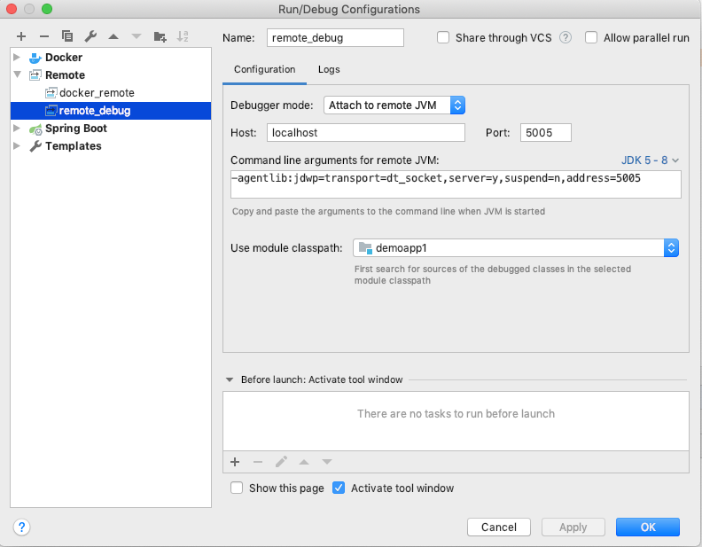

# 개발 활용 소개


## (1) 데이타베이스 연동

mysql 도커 : 
- https://hub.docker.com/_/mysql


호스트 사용자 아이디로 mysql 컨테이너 실행 : 

```bash
$ mkdir data

$ ls -lnd data
drwxr-xr-x 2 1000 1000 4096 Aug 27 15:54 data

$ docker run -v "$PWD/data":/var/lib/mysql --user 1000:1000 --name some-mysql -e MYSQL_ROOT_PASSWORD=my-secret-pw -d mysql:<tag>

$ docker container ls

```

- HOME/data 폴더를 mysql data 폴더로 설정 (사용자는 호스트 사용자 아이디로 지정)
- mysql root 비밀번호 지정.
- tag 는 사용하고자 하는 버전 선택.


데이타베이스 백업 : 

```bash
$ docker exec some-mysql sh -c 'exec mysqldump --all-databases -uroot -p"$MYSQL_ROOT_PASSWORD"' > all-databases.sql

```


데이타베이스 복원 : 

```bash
$ docker exec -i some-mysql sh -c 'exec mysql -uroot -p"$MYSQL_ROOT_PASSWORD"' < all-databases.sql

```


## (2) 자바 개발툴 연동

참고 :

- https://github.com/docker/labs/tree/master/developer-tools/java


자바 샘플 

- https://github.com/doojin88/docker/tree/master/examples/demoapp1


리모트 디버깅 

- 참고
  
  - https://docs.oracle.com/javase/8/docs/technotes/guides/jpda/conninv.html#Invocation


- 프로그램 실행 :

- ```bash
  $ java -agentlib:jdwp=transport=dt_socket,server=y,suspend=n,address=5005 -jar target/demoapp1-1.0.jar

  ```


- IDE 디버그 연결 :  

<div align='center'></div>
<br/>

Docker 를 이용한 디버깅 

- Dockerfile_debug

- ```dockerfile
  FROM openjdk:8u212-jdk
  RUN mkdir -p /app
  COPY target/demoapp1-1.0.jar /app
  WORKDIR /app
  
  #COPY docker/entrypoint.sh /usr/local/bin/
  #RUN ln -s usr/local/bin/entrypoint.sh /entrypoint.sh # backwards compat
  #ENTRYPOINT ["entrypoint.sh"]
  
  EXPOSE 8888 5005
  
  CMD ["java","-agentlib:jdwp=transport=dt_socket,server=y,suspend=n,address=5005","-Djava.security.egd=file:/dev/./urandom","-jar","/app/demoapp1-1.0.jar"]
  ```
  
  
  
