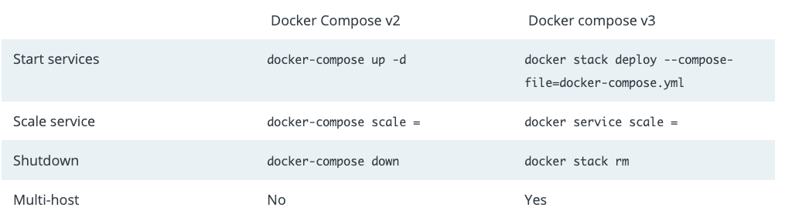

<div align='center'><span style='font-size: 48pt;'><b>Docker 소개 및 체험</b></span></div>
<br/>

# Agenda

- 실습환경 소개  
  
- 도커 소개 
  
- 도커 다루기

  - Dockerfile and command 
  - 도커 Compose 

- 도커 Registry 

- 도커 Swarm 

- [개발 활용 소개](./dev.md)

- [참고](./refs.md)

  

<br/>

# 실습 환경 소개

- docker 실습
  - 개인 장비 : docker 설치
    - [맥 설치](https://docs.docker.com/docker-for-mac/install/)
    - [윈도우 설치](https://docs.docker.com/docker-for-windows/install/)
    - [우분투 설치](https://docs.docker.com/install/linux/docker-ce/ubuntu/)
  - PWD Labs
    - [Play with Docker](https://labs.play-with-docker.com/)
      - Docker ID 필요.
    - Container Public 접속
      - 화면에 표시되는 포트 `8888` 링크 클릭.
- docker registry 실습.
  - https://hub.docker.com/
    - Docker ID 필요.
- 각종 실습 자료
  
  - https://training.play-with-docker.com/
  - https://github.com/docker/labs


<br/>

# 전달하고자 하는 내용

- 도커 소개
  - docker 개요
  - Dockerfile and command
  - docker compose
  - docker swarm
- 오늘 다루지 않는 것
  - 오케스트레이션
  - 서비스 배포 및 운영에 필요한 것
  - kubernetes (k8s), helm, ...

<br/>


# 스터디를 통해 느낀 점


## (1) 스터디 동안 학습한 것

- devops 관련
- terraform
- azure devops
- aws ci/cd
- kubernetes


## (2) 업무 흐름 및 조직의 변화


|                        조직 구조 변화                        |                        업무 프로세스                         |
| :----------------------------------------------------------: | :----------------------------------------------------------: |
|  |  |

> 출처 : https://medium.com/edureka/devops-tutorial-89363dac9d3f


<br/>


## (3) DevOps Tools

<div align='center'></div>
> 출처 : https://www.channelfutures.com/strategy/devops-the-secret-to-doing-more-faster-better-and-for-less-green


<br/>

# Docker 소개


참고 자료

- https://docs.docker.com/engine/docker-overview/
- https://medium.com/edureka/docker-tutorial-9a6a6140d917
- https://containerjournal.com/topics/container-ecosystems/kubernetes-vs-docker-a-primer/


<br/>


## (1) 용어 소개

- VM (virtual machine) vs. Container
  - https://www.docker.com/resources/what-container
- docker registry, repository and image
  - https://nickjanetakis.com/blog/docker-tip-53-difference-between-a-registry-repository-and-image
- docker vs. container
  - linux container


컴퓨팅 자원 : Container vs. VM vs. Bare Metal

|                          VM                           |                          Container                          |
| :----------------------------------------------------------: | :----------------------------------------------------------: |
|  |  |

> 출처 : https://docs.docker.com/get-started/


Docker Architecture
<div align='center'></div>
> 출처 : https://docs.docker.com/engine/docker-overview/


<br/>


## (2) docker.com 살펴 보기

- Docker Document :
  - https://docs.docker.com/
    - [Get started with docker](https://docs.docker.com/get-started/)
- Play with Docker Classroom
  - https://training.play-with-docker.com


<br/>


## (3)  우분투 도커 설치


참고 자료 :

- https://docs.docker.com/
  - [우분투 도커 설치](https://docs.docker.com/install/linux/docker-ce/ubuntu/)


우분투 도커 설치 : 

- 참고 : 
  - https://docs.docker.com/install/linux/docker-ce/ubuntu/


- 도커 설치 :
  ```bash
  $ sudo apt-get update

  $ sudo apt-get install \
      apt-transport-https \
      ca-certificates \
      curl \
      gnupg-agent \
      software-properties-common

  $ curl -fsSL https://download.docker.com/linux/ubuntu/gpg | sudo apt-key add -

  $ sudo apt-key fingerprint 0EBFCD88

  $ sudo add-apt-repository \
     "deb [arch=amd64] https://download.docker.com/linux/ubuntu \
     $(lsb_release -cs) \
     stable"
  
  $ sudo apt-get update
  
  $ sudo apt-get install docker-ce docker-ce-cli containerd.io
  
  $ sudo docker run hello-world
  
  ```


- 스크립트를 이용한 한번에 설치 

  - 스크립트 내용를 자세히 살펴보고 **주의**할 것.

  ```bash
  $ curl -fsSL https://get.docker.com -o get-docker.sh
  
  $ sudo sh get-docker.sh
  
  ```

    

- Non-root user docker 실행

  1. 사용자를 `docker` group에 추가

  ```bash
  $ sudo usermod -aG docker $USER
   
  ```
  2. 로그아웃하고 다시 로긴한다.


- 시스템 리부트

- ```bash
  $ sudo reboot
  
  ```
<br/>

- docker-compose 설치

- ```bash
  $ sudo curl -L "https://github.com/docker/compose/releases/download/1.24.1/docker-compose-$(uname -s)-$(uname -m)" -o /usr/local/bin/docker-compose
  
  $ sudo chmod +x /usr/local/bin/docker-compose
  
  ```

  


## (4) 간단한 도커 실습

참고 링크 : 

- https://training.play-with-docker.com


버전 확인 :

   ```bash
$ docker --version

$ docker-compose --version

   ```


ngnix 서버 실행

```bash
$ docker run --detach --publish=8000:80 --name=webserver nginx

$ docker image ls

$ docker container ls

```

> check: http://localhost:8000/


hello-world 실행

- 참고 링크 : 

  - https://training.play-with-docker.com/ops-s1-hello/

- container 실행

  ```bash
  $ docker run hello-world

  $ docker run -it ubuntu bash

  ```

- hello word : what happened ?
  <div align='center'></div>
  
> 출처 : https://training.play-with-docker.com/ops-s1-hello/

  

Doing More With Docker Images:

- https://training.play-with-docker.com/ops-s1-images/


<br/>


# Dockerfile


## (1) Dockerfile

참고 

- https://docs.docker.com/engine/reference/builder/


주요 키워드 : 

| 구분       | 비고                                                         |
| ---------- | ------------------------------------------------------------ |
| FROM       | 기본이 되는 Docker Image                                     |
| RUN        | Image 작성을 위한 각종 명령어 실행. ex) apt-get install      |
| ENV        | 환경변수 지정.                                               |
| WORKDIR    | 작업 디렉토리 지정.                                          |
| COPY       | 컨테이너로 파일/폴더 복사.                                   |
| ADD        | 컨테이너로 파일/폴더 복사. 참고 : [ADD vs. COPY](https://docs.docker.com/develop/develop-images/dockerfile_best-practices/#add-or-copy) |
| ENTRYPOINT | 컨테이너가 생성될 때 실행할 명령어 지정. 참고: [CMD vs. ENTRYPOINT](https://bluese05.tistory.com/77) |
| EXPOSE     | 컨테이너가 사용하는 포트 표시.                               |
| CMD        | 컨테이너가 실행될 때 실행할 명령어.                          |


## (2) Samples

- [hello-world](https://github.com/docker-library/hello-world/blob/b715c35271f1d18832480bde75fe17b93db26414/amd64/hello-world/Dockerfile)
- [python hello]( https://docs.docker.com/get-started/part2/)
- [Ubuntu](https://github.com/tianon/docker-brew-ubuntu-core/blob/9db8c72dd02e8f9fd5dba82ff9266174b088e2e6/bionic/Dockerfile)
- [mysql](https://github.com/docker-library/mysql/blob/4af273a07854d7e4b68c5148b8e23b86aa8706e2/8.0/Dockerfile)
- [nginx](https://github.com/nginxinc/docker-nginx/blob/e3bbc1131a683dabf868268e62b9d3fbd250191b/mainline/buster/Dockerfile)


### hello-world : 

- https://hub.docker.com/_/hello-world

```
FROM scratch
COPY hello /
CMD ["/hello"]
```


### python hello : 

참고 : 

- https://docs.docker.com/get-started/part2/


app.py 

```
import time

import redis
from flask import Flask

app = Flask(__name__)
cache = redis.Redis(host='redis', port=6379)


def get_hit_count():
    retries = 5
    while True:
        try:
            return cache.incr('hits')
        except redis.exceptions.ConnectionError as exc:
            if retries == 0:
                raise exc
            retries -= 1
            time.sleep(0.5)


@app.route('/')
def hello():
    count = get_hit_count()
    return 'Hello World! I have been seen {} times.\n'.format(count)

```


requirements.txt

```
flask
redis
```


Dockerfile

```dockerfile
# Use an official Python runtime as a parent image
FROM python:2.7-slim

# Set the working directory to /app
WORKDIR /app

# Copy the current directory contents into the container at /app
COPY . /app

# Install any needed packages specified in requirements.txt
RUN pip install --trusted-host pypi.python.org -r requirements.txt

# Make port 80 available to the world outside this container
EXPOSE 80

# Define environment variable
ENV NAME World

# Run app.py when the container launches
CMD ["python", "app.py"]
```


### ubuntu official image :

- https://hub.docker.com/_/ubuntu


<br/>

# Docker Command


참고 자료 :

- https://docs.docker.com/engine/reference/commandline/docker/
- https://github.com/subicura/workshop-k8s-basic/blob/master/guide/guide-01.md
- https://medium.com/edureka/docker-commands-29f7551498a8


## (1) 주요 명령어

참고 : 
- https://docs.docker.com/engine/reference/commandline/docker/
  

명령어 : 

| 구분       | 비고                                                         |
| ---------- | ------------------------------------------------------------ |
| build       | Dockerfile 를 이용하여 도커 이미지 생성한다. |
| run       | 새로운 컨테이너에 명령어를 실행한다. |
| exec       | 존재하는 컨테이너에 명령어를 실행한다. |
| image       | 도커 이미지를 관리한다. |
| volume       | 볼륨을 관리한다. |
| network       | 네트워크를 관리한다. |
| logs       | 컨테이너의 로그를 출력한다. |


## (2) Build

참고 : https://docs.docker.com/engine/reference/commandline/build/

| Name, shorthand | 설명 |
| ---------- | ----------------------------- |
| --tag , -t      | Name and optionally a tag in the ‘name:tag’ format |


<실습>

server.js

```
var http = require('http');
var port = process.env.PORT || 8080;

var handleRequest = function(request, response) {
  console.log('Received request for URL: ' + request.url);
  response.writeHead(200);
  response.end('Hello !!!');
};

var www = http.createServer(handleRequest);

www.listen(port);
```


Dockerfile:

```
FROM node:6.9.2
ENV PORT=8080
COPY server.js .
EXPOSE 8080
CMD node server.js
```


```
$ docker build -t hello .
```


## (3) Run

참고 : https://docs.docker.com/engine/reference/commandline/run/


| Name, shorthand | 설명 |
| ---------- | ----------------------------- |
| --name | Assign a name to the container |
| --interactive , -i | Keep STDIN open even if not attached |
| --tty , -t    | Allocate a pseudo-TTY |
| --detach , -d | Run container in background and print container ID |
| --publish, -p   | Publish a container’s port(s) to the host |
| --network | Connect a container to a network |
| --env , -e | Set environment variables |


<실습>

```
$ docker image ls

$ docker run -it -p 8080:8080 --name hello1 hello

$ docker run -it -p 8082:8082 -e PORT=8082 --name hello2 hello

$ docker container ls -a

```

> check : http://localhost:8080


## (4) Exec

참고 : https://docs.docker.com/engine/reference/commandline/exec/

| Name, shorthand | 설명 |
| ---------- | ----------------------------- |
| --interactive , -i | Keep STDIN open even if not attached |
| --tty , -t    | Allocate a pseudo-TTY |
| --env , -e | Set environment variables |


<실습>

```
$ docker container ls

$ docker container prune

$ docker run -d -p 8080:8080 --name hello1 hello

$ docker container ls

$ docker exec -it hello1 bash
root# 
```


## (5) Image

참고 : https://docs.docker.com/engine/reference/commandline/image/

| Name, shorthand | 설명 |
| ---------- | ----------------------------- |
| docker image ls | List images |
| docker image rm | Remove one or more images |
| docker image save | Save one or more images to a tar archive (streamed to STDOUT by default) |
| docker image load | Load an image from a tar archive or STDIN |
| docker image inspect | Display detailed information on one or more images |
| docker image history | Show the history of an image |


실습 자료 : 

- https://training.play-with-docker.com/docker-images/
- https://training.play-with-docker.com/ops-s1-images/


Local image 저장 및 복구
```bash
$ docker pull nginx

$ docker image ls

$ docker image save nginx -o nginx.tar

$ docker image rm nginx

$ docker image ls

$ docker image load -i nginx.tar

$ docker image ls

```


## (6) Volume

참고 : 

- https://docs.docker.com/engine/reference/commandline/volume_create/
- https://docs.docker.com/storage/volumes/
- https://www.ionos.com/community/server-cloud-infrastructure/docker/understanding-and-managing-docker-container-volumes/


명령어 :

| Name, shorthand | 설명 |
| ---------- | ----------------------------- |
| docker volume create | Create a container volume. |
| docker volume ls | List volumes. |
| docker volume rm | Remove one or more volumes |
| docker volume inspect | Display detailed information on one or more volumes |
| docker volume prune | Remove all unused local volumes |


<실습>

```
$ docker volume ls

$ docker volume create <볼류명>

$ docker volume ls

$ docker volume inspect <볼류명>

```


## (7) Network

참고 :

- https://docs.docker.com/engine/reference/commandline/network/
- https://docs.docker.com/network/
- [Docker Networking - **Explore How Containers Communicate With Each Other](https://medium.com/edureka/docker-networking-1a7d65e89013)**


명령어:

| Name, shorthand        | 설명                                                 |
| ---------------------- | ---------------------------------------------------- |
| docker network create  | Create a network.                                    |
| docker network ls      | List networks.                                       |
| docker network rm      | Remove one or more networks                          |
| docker network inspect | Display detailed information on one or more networks |
| docker network prune   | Remove all unused networks                           |


<실습>


```
$ docker network --help

$ docker network ls

$ docker network create my-network
 
```


<br/>

# Docker Compose


참고 자료 : 

- https://docs.docker.com/compose/
  - https://docs.docker.com/compose/compose-file/
  - https://docs.docker.com/compose/wordpress/

<br/>


## (1) 설치

참고 : 

- https://docs.docker.com/compose/install/


우분투 docker-compose 설치 : 

```bash
$ sudo curl -L "https://github.com/docker/compose/releases/download/1.24.1/docker-compose-$(uname -s)-$(uname -m)" -o /usr/local/bin/docker-compose

$ sudo chmod +x /usr/local/bin/docker-compose

```


<br/>


## (2) Compose File

참고 :

- https://docs.docker.com/compose/compose-file/


Compose v2 vs. v3 :


> 참조 : https://blog.couchbase.com/deploy-docker-compose-services-swarm/


Compose File Example

- 파일 예시 :

- ```
  version: '3.3'
  
  services:
     db:
       image: mysql:5.7
       volumes:
         - db_data:/var/lib/mysql
       restart: always
       environment:
         MYSQL_ROOT_PASSWORD: somewordpress
         MYSQL_DATABASE: wordpress
         MYSQL_USER: wordpress
         MYSQL_PASSWORD: wordpress
  
     wordpress:
       depends_on:
         - db
       image: wordpress:latest
       ports:
         - "8087:80"
       restart: always
       environment:
         WORDPRESS_DB_HOST: db:3306
         WORDPRESS_DB_USER: wordpress
         WORDPRESS_DB_PASSWORD: wordpress
         WORDPRESS_DB_NAME: wordpress
  
  volumes:
      db_data: {}
  ```
  > 참조 : https://docs.docker.com/compose/wordpress/
  


## (3) Command 소개

- 참고

  - https://docs.docker.com/compose/reference/overview/

  - ```bash
    $ docker-comose
    
    Commands:
      build              Build or rebuild services
      bundle             Generate a Docker bundle from the Compose file
      config             Validate and view the Compose file
      create             Create services
      down               Stop and remove containers, networks, images, and volumes
      events             Receive real time events from containers
      exec               Execute a command in a running container
      help               Get help on a command
      images             List images
      kill               Kill containers
      logs               View output from containers
      pause              Pause services
      port               Print the public port for a port binding
      ps                 List containers
      pull               Pull service images
      push               Push service images
      restart            Restart services
      rm                 Remove stopped containers
      run                Run a one-off command
      scale              Set number of containers for a service
      start              Start services
      stop               Stop services
      top                Display the running processes
      unpause            Unpause services
      up                 Create and start containers
      version            Show the Docker-Compose version information
    
    ```

- Compose  생성 및  실행

  ```
  $ docker-compose [-f docker-compose.yml] up -d
  ```

- container 조회

  ```
  $ docker-compose ps
  ```

- Down

  ```
  $ docker-compose [-f docker-compose.yml] down
  ```

  


## (4) Example1 : Python Flask


참고 : 

- https://docs.docker.com/compose/gettingstarted/


### Step 1: Python 웹프로그램 작성

파일 생성

```bash
$ mkdir pyapp1

$ cd pyapp1

$ touch app.py

$ touch requirements.txt

$ touch Dockerfile

$ touch docker-compose.yml

```


app.py 

```python
import time

import redis
from flask import Flask

app = Flask(__name__)
cache = redis.Redis(host='redis', port=6379)


def get_hit_count():
    retries = 5
    while True:
        try:
            return cache.incr('hits')
        except redis.exceptions.ConnectionError as exc:
            if retries == 0:
                raise exc
            retries -= 1
            time.sleep(0.5)


@app.route('/')
def hello():
    count = get_hit_count()
    return 'Hello World! I have been seen {} times.\n'.format(count)
```


requirements.txt

```
flask
redis
```


### Step 2: Dockerfile 작성

Dockerfile

```dockerfile
FROM python:3.7-alpine
WORKDIR /code
ENV FLASK_APP app.py
ENV FLASK_RUN_HOST 0.0.0.0
RUN apk add --no-cache gcc musl-dev linux-headers
COPY requirements.txt requirements.txt
RUN pip install -r requirements.txt
COPY . .
CMD ["flask", "run"]
```


### Step 3: Compose 파일 작성

docker-compose.yml

```dockerfile
version: '3'
services:
  web:
    build: .
    ports:
      - "5000:5000"
  redis:
    image: "redis:alpine"
```


### Step 4: Command 실행

```bash
$ docker-compose up -d

$ docker-compose ps

$ docker image ls

$ docker container ls

$ docker network ls

$ docker volume ls

```


### Step 5: 웹서비스 접속

- http://localhost:5000/


### Step 6: 자원 정리

```
$ docker-compose down

$ docker volume prune

$ docker network prune

```


## (5) Example2 : Wordpress


참고 

- https://docs.docker.com/compose/wordpress/
- https://hub.docker.com/_/wordpress/


### Step 1 : Project 폴더 생성

```
$ mkdir wordpress

$ cd wordpress

```


### Step 2: Compose 파일 작성

docker-compose.yml

```
version: '3.3'

services:
   db:
     image: mysql:5.7
     volumes:
       - db_data:/var/lib/mysql
     restart: always
     environment:
       MYSQL_ROOT_PASSWORD: somewordpress
       MYSQL_DATABASE: wordpress
       MYSQL_USER: wordpress
       MYSQL_PASSWORD: wordpress

   wordpress:
     depends_on:
       - db
     image: wordpress:latest
     ports:
       - "8087:80"
     restart: always
     environment:
       WORDPRESS_DB_HOST: db:3306
       WORDPRESS_DB_USER: wordpress
       WORDPRESS_DB_PASSWORD: wordpress
       WORDPRESS_DB_NAME: wordpress

volumes:
    db_data: {}
```


### Step 3: Compose 실행

docker compose 서비스 실행

```
$ docker-compose up -d

$ docker-compose ps 

```


### Step 4: WordPress 웹접속

web browser 접속

- http://localhost:8087/


### Step 5: Compose 정리

```
$ docker-compose down

$ docker volume prune

$ docker network prune
```


<br/>

# Docker Registry

<u>**Registry 사이트**</u> : 

- https://hub.docker.com/


**<u>Image 등록</u>** :

- Docker hub 로긴

  ```
  docker login
  ```

- PUSH 등록

  ```bash
  $ docker pull hello-world
    
  $ docker images
  
  $ docker tag hello-world:latest <DOCKER-ID>/hello-world
  
  $ docker images
  
  $ docker push <DOCKER-ID>/hello-world
  
  ```

- Docker repository 확인
  - 사이트에서 확인 
    - [https://hub.docker.com](https://hub.docker.com/)


<br/>


# Docker Swarm

참고 :

- https://docs.docker.com/engine/swarm/

Swarm Ingress Network :

<div align="center"></div>
> 출처 : https://docs.docker.com/engine/swarm/ingress/


<br/>


## (1) Swarm 실행

```bash
$ docker swarm init --advertise-addr <IP>

$ docker stack ls

$ docker swarm join-token --help

```


## (2) Example: Wordpress1

폴더 생성 :

```bash
$ mkdir wordpress1

$ cd wordpress1

```


docker-compose.yml

```dockerfile
version: '3.3'

services:
   db:
     image: mysql:5.7
     volumes:
       - db_data:/var/lib/mysql
     restart: always
     environment:
       MYSQL_ROOT_PASSWORD: somewordpress
       MYSQL_DATABASE: wordpress
       MYSQL_USER: wordpress
       MYSQL_PASSWORD: wordpress

   wordpress:
     depends_on:
       - db
     image: wordpress:latest
     ports:
       - "8087:80"
     restart: always
     environment:
       WORDPRESS_DB_HOST: db:3306
       WORDPRESS_DB_USER: wordpress
       WORDPRESS_DB_PASSWORD: wordpress
       WORDPRESS_DB_NAME: wordpress

volumes:
    db_data: {}
```


wordpress1 swarm service 실행

```bash
$ docker stack deploy -c docker-compose.yml wordpress1

$ docker stack ls

$ docker service ls

$ docker stack rm wordpress2
```


## (3) Example: Wordpress2

폴더 생성 :

```bash
$ mkdir wordpress2

$ cd wordpress2

```


stack.yml

```
version: '3.1'

services:

  wordpress:
    image: wordpress
    restart: always
    ports:
      - 8088:80
    environment:
      WORDPRESS_DB_HOST: db
      WORDPRESS_DB_USER: exampleuser
      WORDPRESS_DB_PASSWORD: examplepass
      WORDPRESS_DB_NAME: exampledb
    volumes:
      - wordpress:/var/www/html

  db:
    image: mysql:5.7
    restart: always
    environment:
      MYSQL_DATABASE: exampledb
      MYSQL_USER: exampleuser
      MYSQL_PASSWORD: examplepass
      MYSQL_RANDOM_ROOT_PASSWORD: '1'
    volumes:
      - db:/var/lib/mysql

volumes:
  wordpress:
  db:

```


wordpress2 swarm service 실행

```bash
$ docker stack deploy -c stack.yml wordpress2

$ docker stack ls

$ docker service ls

$ docker stack rm wordpress2

```


## (4) Example : Voting App

- 설정 파일
  - https://raw.githubusercontent.com/dockersamples/example-voting-app/master/docker-stack.yml
- 실습 가이드
  - https://training.play-with-docker.com/ops-s1-swarm-intro/


## (5) Swarm 정리

```
$ docker swarm leave [--force]
```


<br/>


