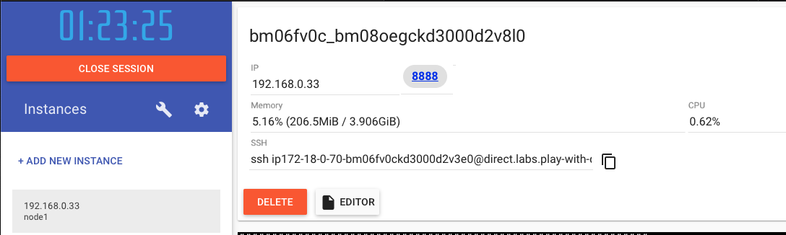

# 참고


## (1) Docker 실습 환경 설정


Play with Docker 실습 환경 :

- [https://labs.play-with-docker.com](https://labs.play-with-docker.com/)


Swarm 설정 Commands

```
[MASTER]
$ docker swarm init --advertise-addr <MASTER IP>
  
  docker swarm join --token <TOKEN> <MASTER IP>:2377
  
$ docker node ls


[WORKER]
$ docker swarm join --token <TOKEN> <MASTER IP>:2377

```


Public 웹접속 : 

- 화면에 표시되는 포트 클릭
- Exampe: 
  - 화면  `8888` 링크 클릭.
  - 


<br/>


## (2) Mac 에서 Docker Volume 탐색

- Mac

  ```bash
  $ docker volume ls
  
  $ screen -ls
  
  $ screen ~/Library/Containers/com.docker.docker/Data/com.docker.driver.amd64-linux/tty
  
  <ENTER>
  
  docker-desktop:~# cd /var/lib/docker/volumes
  
  docker-desktop:~# ls -al
  
  CTRL-a + CTRL-k
  
  $ screen -ls
  
  
  ```


<br/>


## (3) Spring Boot App 만들기

### Step 1: Demo App 생성

- https://start.spring.io/
  - Project : maven project
  - Language : java
  - Spring Boot : 2.1.8
  - Project Metadata : 
    - Group : com.example
    - Artifact : demoapp1
  - Dependencies : Spring Web


### Step 2: 컴파일 및 실행

- 프로잭트 생성

  ```
  $ unzip demoapp1.zip
  $ cd demoapp1
  ```

- src/main/resources/static/index.html 추가

  ```
  <!DOCTYPE html>
  <html lang="en">
  <head>
      <meta charset="UTF-8">
      <title>DEMO APP</title>
  </head>
  <body>
  DEMOAPP 1.0.0
  </body>
  </html>
  ```

- 패키징

  ```
  $ ./mvnw clean package
  ```

- 어플리케이션 실행

  ```
  $ java -jar target/demoapp1-0.0.1-SNAPSHOT.jar
  ```

- 어플리케이션 접속 확인

  ```
  $ curl http://localhost:8080/
  ```


