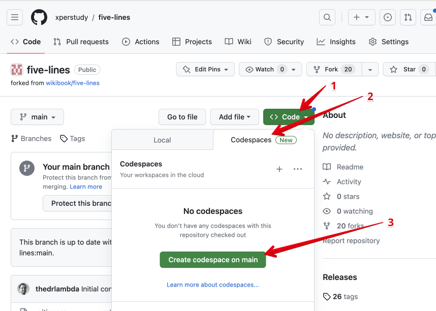
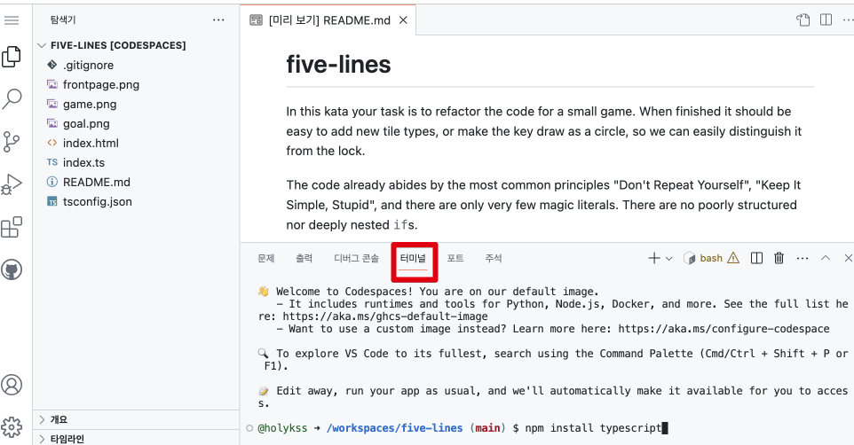
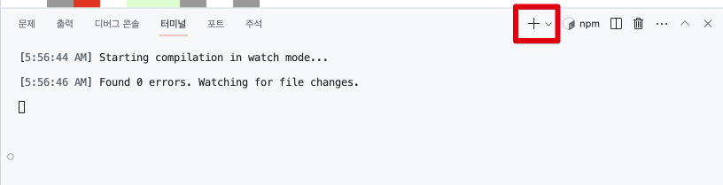
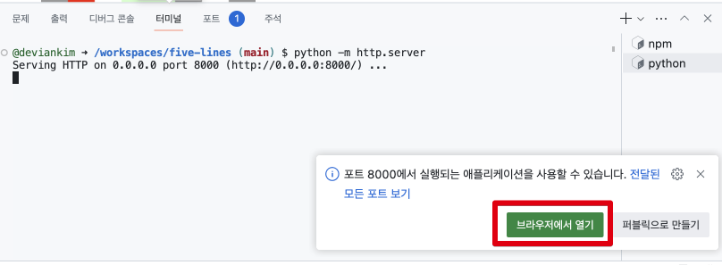
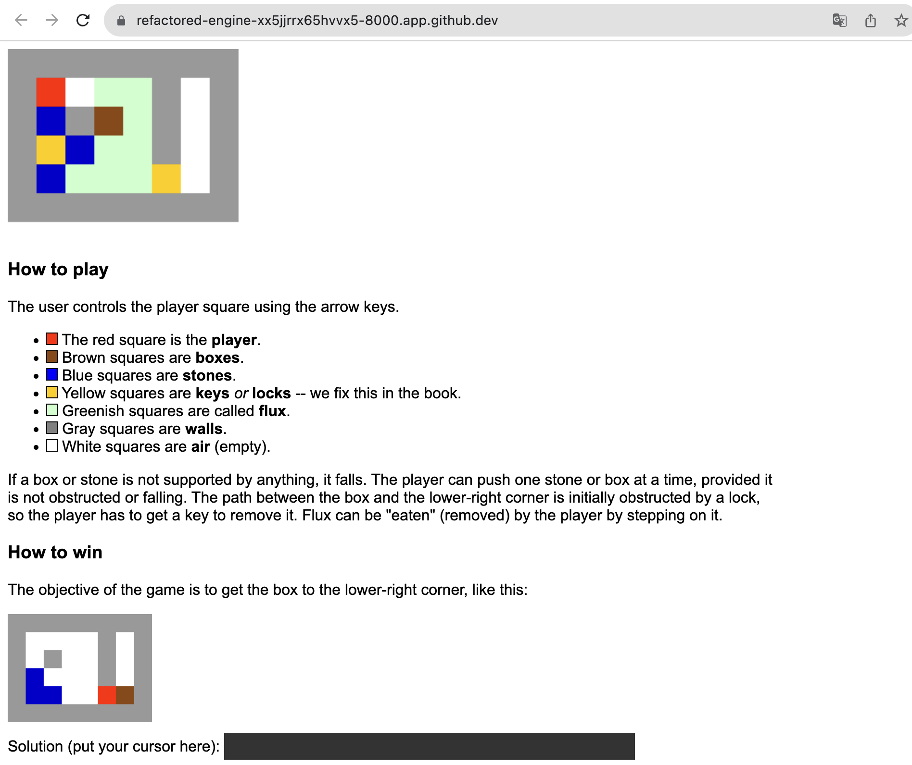
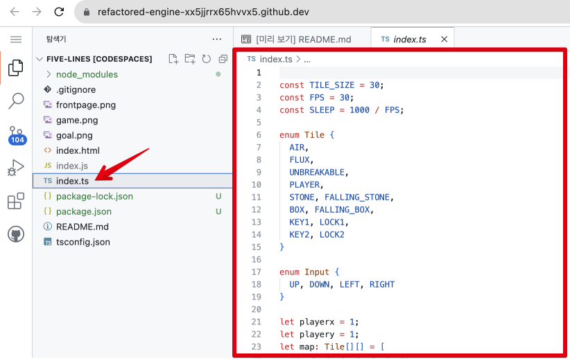

# github codespace guide

## 사전 준비

1. 웹 브라우저를 준비합니다. (크롬에서 테스트 했습니다.)
2. [github.com](http://github.com) 에 로그인 합니다.
3. 주소창에 [https://github.com/xperstudy/five-lines](https://github.com/xperstudy/five-lines) 을 입력합니다.

## 1. codespace 생성

1~3분 소요 됩니다.



codespace

## 2. terminal 창 열기



terminal

## 3. typescript 설치 및 실행

```bash
# tsc 실행을 위해 필요한 모듈을 설치합니다.
npm install typescript

# watch 옵션을 주어 내용 변경시마다 빌드하도록 합니다.
npx tsc -w
```

## 4. 웹서버 설정

### 터미널 창을 하나 더 열어서 python 웹 서버를 실행합니다.



new terminal

```bash
python -m http.server
```

### 웹서버가 구동되면 [브라우저에서 열기]를 클릭 합니다.

[포트 탭]을 통해서도 동일한 동작을 할 수 있습니다.



open web page

### 새 창이 열리면서 결과물을 확인할 수 있습니다. (WASD 로 조작합니다.)



game page

## 5. 코드 수정

코드 수정 후 결과물을 확인하려면, 반드시 브라우저를 리프레시 해주세요.



edit code

## 동영상 (자막)
[https://www.youtube.com/watch?v=4l18Q1LqG6k](https://www.youtube.com/watch?v=4l18Q1LqG6k)

